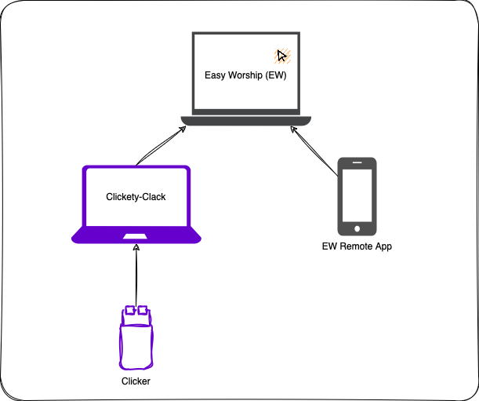

[](https://github.com/dvoaviarison/clickety-clack/actions/workflows/dotnet.yml)
# Clickety-Clack aka EW-Desktop-Remote
A simple, open source and cross-platform EasyWorship Remote App that works on laptops (mac/windows/linux).
This allows for the use of a clicker without losing control on you EW main computer.

## How it works
Why Choose Complexity Over Simplicity?

- **Dilemma**: You want control over the main EasyWorship machine.
   - **Clicker Solution**: Using a clicker is an easy way to control the slides, but it locks the machine to Easy-Worship only.
   - **Phone App Solution**: The EW Remote App unlocks Easy-Worship, but it’s sensitive and distracting.
- **Ideal Solution**: 
   - **Clickety-Clack**: Slide control without locking down the main computer. Best of both worlds! 🍌💡.
   - Here is how it works 


  

## Pre-req.
- Install dotnet runtime ([.Net8](https://dotnet.microsoft.com/en-us/download/dotnet/8.0))

## How to use
This app is cross platform and can be used in Windows, Linux or MacOS.

Download latest version [HERE](https://github.com/dvoaviarison/Clickety-Clack/releases) and extract the zip file
- For windows: Double click on `ClicketyClack.ConsoleHost.exe`
- For Linux: Run the following command line from within the app folder
  ```bash
  ./ClicketyClack.ConsoleHost
  ```
- For MacOS: Double click on `ClicketyClack.ConsoleHost.command`.

  You might need to run this one time command line first, to give permissipn to execute 
  ```bash
   chmod +x ClicketyClack.ConsoleHost.command
   ```


## Want to contribute
Fork, PR, Get a review, Merge